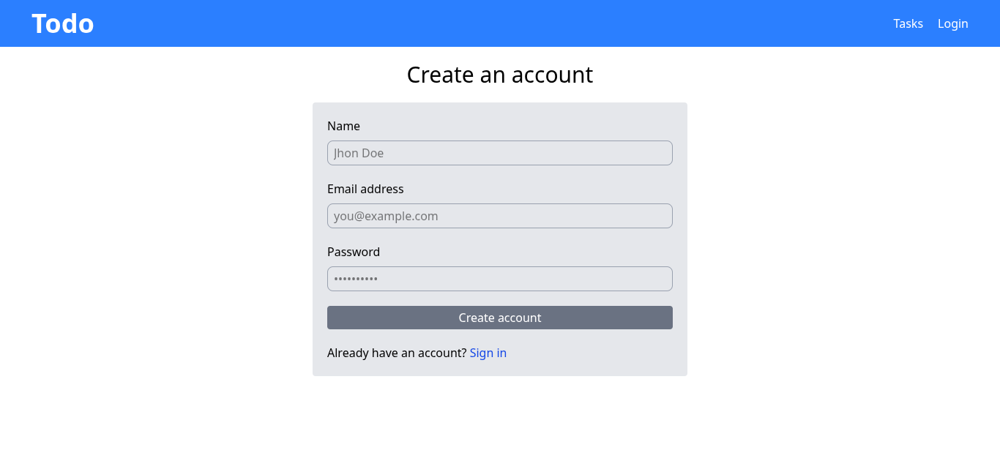

# MERN Todo App with Authentication

This is a full-stack **MERN** (MongoDB, Express.js, React, Node.js) todo application. It features user authentication, allowing users to register, log in, and manage their own private task lists.

## 🚀 Features

- **Authentication**: Secure user login and registration using **JWT**.
- **CRUD**: Users can **create**, **read**, **update**, and **delete** their todos.
- **Personalized Lists**: Each user has their own dedicated todo list.
- **Modern UI**: Built with **React** and styled using **Tailwind CSS**.

## 📸 Page Views

#### Register

Users can create a new account on the register page.


#### Login

Existing users can log in to access their todos and profile on the login page.


#### Profile

Once logged in, users can view their profile information on the profile page.


#### Home

The home page displays the user's personal list of todo tasks. This page is protected and requires login.


## 📋 API Endpoints

This application exposes a RESTful API with two main categories of endpoints: Auth and User. All successful responses return a 200 OK status code unless otherwise noted.

#### Auth Routes

These endpoints handle user authentication, including registration, login, and logout.

`POST /api/v1/auth/register`

- **Description**: Registers a new user account.

- **Request Body**:
  - `name`: string, **optional**

  - `email`: string, **required** (must be a valid email format)

  - `password`: string, **required**

- **Success Response**: `201 Created`

- **Returns**: a JWT `token` and the `user` object.

```json
{
  "token": "eyJhbGciOiJIUzI1NiIsInR5cCI6IkpXVCJ9...",
  "user": {
    "id": "60c72b2f9b1e8e001c9b6f5d",
    "name": "John Doe",
    "email": "john.doe@example.com"
  }
}
```

`POST /api/v1/auth/login`

- **Description**: Authenticates a user and returns a token.

- **Request Body**:
  - `email`: string, **required**

  - `password`: string, **required**

- **Success Response**: `200 OK`

- **Returns**: a JWT `token` and the `user` object.

```json
{
  "token": "eyJhbGciOiJIUzI1NiIsInR5cCI6IkpXVCJ9...",
  "user": {
    "id": "60c72b2f9b1e8e001c9b6f5d",
    "name": "John Doe",
    "email": "john.doe@example.com"
  }
}
```

`POST /api/v1/auth/logout`

- **Description**: Logs out the authenticated user.

- **Authentication**: Required

- **Success Response**: `200 OK`

- **Returns**: a success message.

```json
{
  "message": "User logged out successfully"
}
```

#### User Routes

These endpoints are for managing user-specific data. All routes in this section are protected and require a valid JWT in the Authorization header (Bearer <token>).

`GET /api/v1/user`

- **Description**: Retrieves the authenticated user's information.

- **Authentication**: Required

- **Success Response**: `200 OK`

- **Returns**: The user object.

```json
{
  "user": {
    "id": "60c72b2f9b1e8e001c9b6f5d",
    "name": "John Doe",
    "email": "john.doe@example.com"
  }
}
```

`GET /api/v1/user/tasks`

- **Description**: Fetches all tasks for the authenticated user.

- **Authentication**: Required

- **Success Response**: `200 OK`

- **Returns**: An array of task objects.

```json
{
  "tasks": [
    {
      "id": "60c72c579b1e8e001c9b6f5e",
      "title": "Finish the README file",
      "isDone": false,
      "userId": "60c72b2f9b1e8e001c9b6f5d"
    },
    {
      "id": "60c72c6c9b1e8e001c9b6f5f",
      "title": "Push to GitHub",
      "isDone": true,
      "userId": "60c72b2f9b1e8e001c9b6f5d"
    }
  ]
}
```

`POST /api/v1/user/tasks`

- **Description**: Creates a new task for the authenticated user.

- **Authentication**: Required

- **Request Body**:
  - `title`: string, **required**

- **Success Response**: `201 Created`

- **Returns**: a success message and the newly created task object.

```json
{
  "message": "Task created successfully",
  "task": {
    "id": "60c72c579b1e8e001c9b6f5e",
    "title": "Finish the README file",
    "isDone": false,
    "userId": "60c72b2f9b1e8e001c9b6f5d"
  }
}
```

`PATCH /api/v1/user/task/:id`

- **Description**: Updates a specific task by its ID.

- **Authentication**: Required

- **URL Parameters**:
  - `id`: string, required (The ID of the task to update)

- **Request Body**:
  - Any of the following fields can be updated: `title`, `isDone`.

- **Success Response**: `200 OK`

- **Returns**: a success message and the updated task object.

```json
{
  "message": "Task updated successfully",
  "task": {
    "id": "60c72c579b1e8e001c9b6f5e",
    "title": "Finish the README file",
    "isDone": true,
    "userId": "60c72b2f9b1e8e001c9b6f5d"
  }
}
```

`DELETE /api/v1/user/task/:id`

- **Description**: Deletes a specific task by its ID.

- **Authentication**: Required

- **URL Parameters**:
  - `id`: string, required (The ID of the task to delete)

- **Success Response**: `200 OK`

- **Returns**: a success message.

```json
{
  "message": "Task deleted successfully"
}
```

## 🛠️ Tech Stack

### Backend

- **Node.js**: Runtime environment.
- **Express.js**: API framework.
- **TypeScript**: Statically typed JavaScript.
- **Mongoose**: MongoDB object modeling.
- **bcrypt**: Password hashing.
- **JWT**: For authentication.

### Frontend

- **React**: UI library.
- **Vite**: Build tool.
- **React Router Dom**: Client-side routing.
- **Axios**: HTTP client.
- **React Query**: Server-state management.
- **Tailwind CSS**: Utility-first styling.

## ⚙️ Getting Started

To get the project running on your local machine, follow these steps.

### Prerequisites

- **Node.js**
- **MongoDB** (local or cloud instance)

### Installation

1.  **Clone the repository**:

    ```bash
    git clone https://github.com/eslam-dv/mern-todo-app.git
    cd mern-todo-app
    ```

2.  **Backend setup**:

    ```bash
    cd backend
    npm install
    ```

    Create a `.env` file with your credentials:

    ```env
    NODE_ENV=development
    MONGO_URI=your_mongodb_connection_string
    JWT_SECRET=your_jwt_secret
    APP_ORIGIN=http://localhost:5173
    PORT=your_backend_port # defaults to 3001
    ```

3.  **Frontend setup**:

    ```bash
    cd ../frontend
    npm install
    ```

    Create a `.env` file with the API URL:

    ```env
    VITE_API_URL=http://localhost:3001
    ```

## ▶️ Running the App

Run the backend and frontend in separate terminals.

**Backend**:

```bash
cd backend
npm run dev
```

**Frontend**:

```bash
cd frontend
npm run dev
```

The frontend will be available at `http://localhost:5173`.

## 📦 Deployment

### Production Build

**Backend**:

```bash
cd backend
npm run build
node dist/index.js
```

**Frontend**:

```bash
cd frontend
npm run build
```

This command creates a `dist` folder with the optimized files for deployment on a static hosting service.
